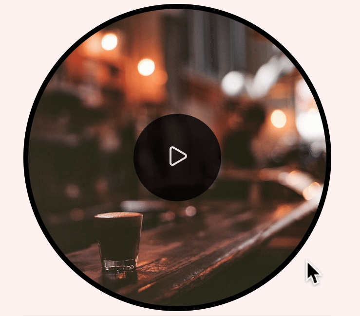

# Ambient Sounds Web Components

> _Example `<coffee-shop-ambience>` component:_
>
> 

<br />

See full [demo]().

## Components

### Fire

```html
<fire-ambience>
</fire-ambience>
```

### Thunderstorm

```html
<thunderstorm-ambience>
</thunderstorm-ambience>
```

### Heavy rain

```html
<heavy-rain-ambience>
</heavy-rain-ambience>
```

### Rain on window

```html
<rain-on-window>
</rain-on-window>
```

### Waves

```html
<waves-ambience>
</waves-ambience>
```

### Wind

```html
<wind-ambience>
</wind-ambience>
```

### Coffee shop

```html
<coffee-shop-ambience>
</coffee-shop-ambience>
```

### Birds

```html
<birds-ambience>
</birds-ambience>
```

### Cat purr

```html
<cat-purr>
</cat-purr>
```

### Books

```html
<books-ambience>
</books-ambience>
```

### Walking on forest road

```html
<walking-on-forest-road>
</walking-on-forest-road>
```

### Typing

```html
<typing-ambience>
</typing-ambience>
```

### Crickets at night

```html
<crickets-at-night>
</crickets-at-night>
```

### Eerie forest

```html
<eerie-forest-ambience>
</eerie-forest-ambience>
```

## Usage

The components import and extend the `PlayBox` class, so make sure you have [`play-box.js`]().

Add the component you'd like to use, for example:

```html
<script type="module" src="heavy-rain.js" defer></script>
```

Make sure you have the assets (audio and image sources) for the components. (for example, [assets/heavy-rain]()).

Then use it in your HTML:

```html
<heavy-rain-ambience></heavy-rain-ambience>
```

## Attributes

The `PlayBox` element has the following attributes:

- `overlayColor`
  - _Border and button background color._
  - Default: `#000`.
- `iconColor`
  - _Play/pause SVGs' stroke color_.
  - Default: `#fff`.
- `buttonPosition`
  - One of `"top"`, `"top-left"`, `"top-right"`, `"center"`, `"bottom"`, `"bottom-left"`, `"bottom-right"`.
  - Default: `"center"`.
- `boxBorderRadius`
  - One of `"none"`, `"full"`, `"x-small"`, `"small"`, `"medium"`, `"large"`, `"x-large"`.
  - Default: `"full"`.
- `buttonBorderRadius`
  - One of `"none"`, `"full"`, `"x-small"`, `"small"`, `"medium"`, `"large"`, `"x-large"`.
  - Default: `"full"`.

## Make your own 

You can create your own custom element by extending the `PlayBox` class.

Define the path or URL to audio and image sources:

```js
const AUDIO_SRC = '/path/to/audio/file';
const IMAGE_SRC = '/path/to/image/file';
```

Create your custom element class, and set the audio and image:

```js
class MyCustomElement extends PlayBox {
  constructor() {
    super();
  }

  connectedCallback() {
    super.connectedCallback();

    this._audioEl.src = AUDIO_SRC;
    this._boxDiv.style.backgroundImage = `url("${IMAGE_SRC}")`;
  }
}
```

Register it:

```js
if (!customElements.get('my-custom-element')) {
  customElements.define('my-custom-element', MyCustomElement);
}
```

Here it is in full:

```js
const AUDIO_SRC = '/path/to/audio/file';
const IMAGE_SRC = '/path/to/image/file';

class MyCustomElement extends PlayBox {
  constructor() {
    super();
  }

  connectedCallback() {
    super.connectedCallback();

    this._audioEl.src = AUDIO_SRC;
    this._boxDiv.style.backgroundImage = `url("${IMAGE_SRC}")`;
  }
}

if (!customElements.get('my-custom-element')) {
  customElements.define('my-custom-element', MyCustomElement);
}
```

## Credits
*   Fire
    *   Sound: [Fireplace](https://freesound.org/people/inchadney/sounds/132534/) by [inchadney](https://freesound.org/people/inchadney/) | License: [Creative Commons 0](http://creativecommons.org/publicdomain/zero/1.0/)
    *   Image: [Photo](https://unsplash.com/photos/bonfire-during-nighttime-XHrq43cIss0) by [Riley sporle](https://unsplash.com/@rizovo) on [Unsplash](https://unsplash.com)
*   Thunderstorm
    *   Sound: [Heavy Thunder Strike](https://freesound.org/people/BlueDelta/sounds/446753/) by [BlueDelta](https://freesound.org/people/BlueDelta/) | License: [Creative Commons 0](http://creativecommons.org/publicdomain/zero/1.0/)
    *   Image: [Photo](https://unsplash.com/photos/lightning-strike-on-the-sky-m4QBTHMYg-Q) by [Milen Kolev](https://unsplash.com/@milen_kolev) on [Unsplash](https://unsplash.com)
*   Heavy rain
    *   Sound: [Heavy Rain](https://freesound.org/people/lebaston100/sounds/243629/) by [lebaston100](https://freesound.org/people/lebaston100/) | License: [Attribution 4.0](https://creativecommons.org/licenses/by/4.0/)
    *   Image: [Photo](https://www.pexels.com/photo/water-droplets-in-tilt-shift-lens-8345318) by [Animesh Srivastava](https://www.pexels.com/@animesh-srivastava-3019173) from [Pexels](https://www.pexels.com)
*   Rain on window
    *   Sound: [Rain on Windows, Interior, A](https://freesound.org/people/InspectorJ/sounds/346642/) by [InspectorJ](https://freesound.org/people/InspectorJ/) | License: [Attribution 4.0](https://creativecommons.org/licenses/by/4.0/)
    *   Image: [Photo](https://unsplash.com/photos/raindrops-on-clear-window-Bu1zj2WbjHE) by [Anant Jain](https://unsplash.com/@anant90) on [Unsplash](https://unsplash.com)
*   Waves
    *   Sound: [North Sea](https://freesound.org/people/Soarer/sounds/13793/) by [Soarer](https://freesound.org/people/Soarer/) | License: [Attribution 4.0](https://creativecommons.org/licenses/by/4.0/)
    *   Image: [Photo](https://unsplash.com/photos/a-large-body-of-water-with-waves-in-it-axUVJB5tH-I) by [White Malaki](https://unsplash.com/@malakiwhite17) on [Unsplash](https://unsplash.com)
*   Wind
    *   Sound: [Strong wind](https://freesound.org/people/guillermochicasonido/sounds/660464/) by [guillermochicasonido](https://freesound.org/people/guillermochicasonido/) | License: [Attribution 4.0](https://creativecommons.org/licenses/by/4.0/)
    *   Image: [Photo](https://www.pexels.com/photo/misty-landscape-with-lone-tree-in-fog-28625820) by [Alexandre Moreira](https://www.pexels.com/@alexandre-moreira-2527876) from [Pexels](https://www.pexels.com)
*   Coffee shop
    *   Sound: [coffee shop ambience](https://freesound.org/people/waweee/sounds/370973/) by [waweee](https://freesound.org/people/waweee/) | License: [Creative Commons 0](http://creativecommons.org/publicdomain/zero/1.0/)
    *   Image: [Photo](https://unsplash.com/photos/shot-glass-on-table-Y-RyEJ8eqHc) by [andrew welch](https://unsplash.com/@andrewwelch3) on [Unsplash](https://unsplash.com)
*   Birds
    *   Sound: [Morning in the country](https://freesound.org/people/inchadney/sounds/56611/) by [inchadney](https://freesound.org/people/inchadney/) | License: [Attribution 4.0](https://creativecommons.org/licenses/by/4.0/)
    *   Image: [Photo](https://unsplash.com/photos/yellow-and-black-bird-on-brown-tree-branch-SVP1CS5b9e4) by [valentin hintikka](https://unsplash.com/@valentinhintikka) on [Unsplash](https://unsplash.com)
*   Cat purr
    *   Sound: [purring happy cat](https://freesound.org/people/Minscer/sounds/424355/) by [Minscer](https://freesound.org/people/Minscer/) | License: [Creative Commons 0](http://creativecommons.org/publicdomain/zero/1.0/)
    *   Image: [Photo](https://www.pexels.com/photo/relaxed-ginger-cat-sleeping-on-wooden-surface-30389394) by [Can Ceylan](https://www.pexels.com/@can-ceylan-2148269005) from [Pexels](https://www.pexels.com)
*   Books
    *   Sound: [Very Old Book Page Turns;cracking](https://freesound.org/people/Australopithecusman/sounds/388947/) by [Australopithecusman](https://freesound.org/people/Australopithecusman/) | License: [Attribution 4.0](https://creativecommons.org/licenses/by/4.0/)
    *   Image: [Photo](https://unsplash.com/photos/books-on-brown-wooden-shelf-2NT3cqLN21k) by [Mihai Lazăr](https://unsplash.com/@mihai14) on [Unsplash](https://unsplash.com)
*   Walking on forest road gravel & grass
    *   Sound: [Going on a forest road gravel and grass.wav](https://freesound.org/people/straget/sounds/411206/) by [straget](https://freesound.org/people/straget/) | License: [Creative Commons 0](http://creativecommons.org/publicdomain/zero/1.0/)
    *   Image: [Photo](https://unsplash.com/photos/a-dirt-road-in-the-middle-of-a-lush-green-forest-ymgNndSAEnI) by [Nereid Ndreu](https://unsplash.com/@nereiq) on [Unsplash](https://unsplash.com)
*   Typing
    *   Sound: [Mechanical Keyboard Typing](https://freesound.org/people/GeorgeHopkins/sounds/537244/) by [GeorgeHopkins](https://freesound.org/people/GeorgeHopkins/) | License: [Attribution 4.0](https://creativecommons.org/licenses/by/4.0/)
    *   Image: [Photo](https://unsplash.com/photos/white-ceramic-mug-8fMHWkbZC54) by [Andrew M](https://unsplash.com/@andymant) on [Unsplash](https://unsplash.com)
*   Crickets at night
    *   Sound: [Ambience Night Field Cricket 01](https://freesound.org/people/sengjinn/sounds/175020/) by [sengjinn](https://freesound.org/people/sengjinn/) | License: [Creative Commons 0](http://creativecommons.org/publicdomain/zero/1.0/)
    *   Image: [Photo](https://unsplash.com/photos/a-bird-is-standing-in-the-grass-near-a-body-of-water-wk2gQASoPxM) by [Leonid Filinov](https://unsplash.com/@leonid_filinov) on [Unsplash](https://unsplash.com)
*   Eerie forest
    *   Sound: [eerie\_forest](https://freesound.org/people/gregswinford/sounds/70100/) by [gregswinford](https://freesound.org/people/gregswinford/) | License: [Attribution 4.0](https://creativecommons.org/licenses/by/4.0/)  
        [Tawny Owls .wav](https://freesound.org/people/Benboncan/sounds/63842/) by [Benboncan](https://freesound.org/people/Benboncan/) | License: [Attribution 4.0](https://creativecommons.org/licenses/by/4.0/)  
        [Owls.wav](https://freesound.org/people/Benboncan/sounds/63220/) by [Benboncan](https://freesound.org/people/Benboncan/) | License: [Attribution 4.0](https://creativecommons.org/licenses/by/4.0/)  
        [Crows\_01.wav](https://freesound.org/people/Q.K./sounds/56233/) by [Q.K.](https://freesound.org/people/Q.K./) | License: [Creative Commons 0](http://creativecommons.org/publicdomain/zero/1.0/)  
        [creeeeek-GAIN\_01.wav](https://freesound.org/people/XxBirdoxX/sounds/52288/) by [XxBirdoxX](https://freesound.org/people/XxBirdoxX/) | License: [Creative Commons 0](http://creativecommons.org/publicdomain/zero/1.0/)  
        [20071104.forest.04.binaural.mp3](https://freesound.org/people/dobroide/sounds/43661/) by [dobroide](https://freesound.org/people/dobroide/) | License: [Attribution 4.0](https://creativecommons.org/licenses/by/4.0/)  
        [20060706.night.forest02.flac](https://freesound.org/people/dobroide/sounds/20575/) by [dobroide](https://freesound.org/people/dobroide/) | License: [Attribution 4.0](https://creativecommons.org/licenses/by/4.0/)  
        [20060706.night.cricket.flac](https://freesound.org/people/dobroide/sounds/20573/) by [dobroide](https://freesound.org/people/dobroide/) | License: [Attribution 4.0](https://creativecommons.org/licenses/by/4.0/)
    *   Image: [Photo](https://unsplash.com/photos/green-and-brown-trees-during-daytime-z_Uv_-Qbeco) by [Irene Gambarara](https://unsplash.com/@irenegambarara) on [Unsplash](https://unsplash.com)

## License
MIT
